# EqManage

Equipment Management System Built with PHP

**Never use this in production it's very insecure**

**Reinstall all libraries in /Vendor as some files are altered accidentally when removing credentials**

## Features (PHP/SQL Techniques):
### Signup/Login/Authentication
- ~~Secure~~ authentication - using prepared statement, password_verify/hash, real_escape_string
- User session and redirection - using PHP SESSION, header (Not secure at all)
### Cart & Checkout Request
- Live update cart - using Ajax, jQuery .html, calling function onchange/click + .value 
- Storing data - using nested IF statement, POST, SESSION, loops, 2d/3d array, array_push, PHP unset
- Dynamically changing forms depending on cart existence and filling ‘Select’ with categorisation - using optgroup, left join/group by/order by query, complex conditions
- Empty field validation on submit - using SESSION, document.forms, array manipulation, alert, Javascript + PHP integration, event prevent default
### Manage Equipment
- Uploading + Processing Images - croppie API, base64_decode, explode string, random number generator, file_put_contents
- Adding/deleting equipment & category and displaying equipment without reload - using INSERT query, getElementById value, displaying/hiding elements, POST, unlink/delete directory, Inner join query, Ajax
### Barcode
- Download Barcode of equipment as Image - using readfile, file_put_contents, die error handling, DOCUMENT_ROOT/file path, Picqer Barcode Generator API
- Generating Barcode PDF - TCPDF API, Picqer Barcode Generator API, array, mathematical operators
### Home Page
- Display equipment status details + filter and order - Query manipulation using switch case statement, jQuery .html
- Preventing cart dropdown from closing when pressed outside - using stop_propagation, event preventDefault, querySelector, classList.contains
- Searching for equipment - using Javascript Keyup event
### Dashboard + Admin Checkout/Return
- Displaying real-time graph - using JSON_encode, getJSON, arrays, CanvasJS API
- Live fetch dashboard data - using XMLHttpRequest (XHR), .innerHTML
- Dynamically fill select & barcode reader compatible when checkout - Select2 API, json_encode array, Select distinct query
- Displaying and updating Notification - using MySQL Query
- Displaying checkout/return modal for every admin page - using PHP include, SESSION
### Search
- Update/display without refreshing entire page - using PHP load, GET, switch case conditions, .trigger

## Gallary:

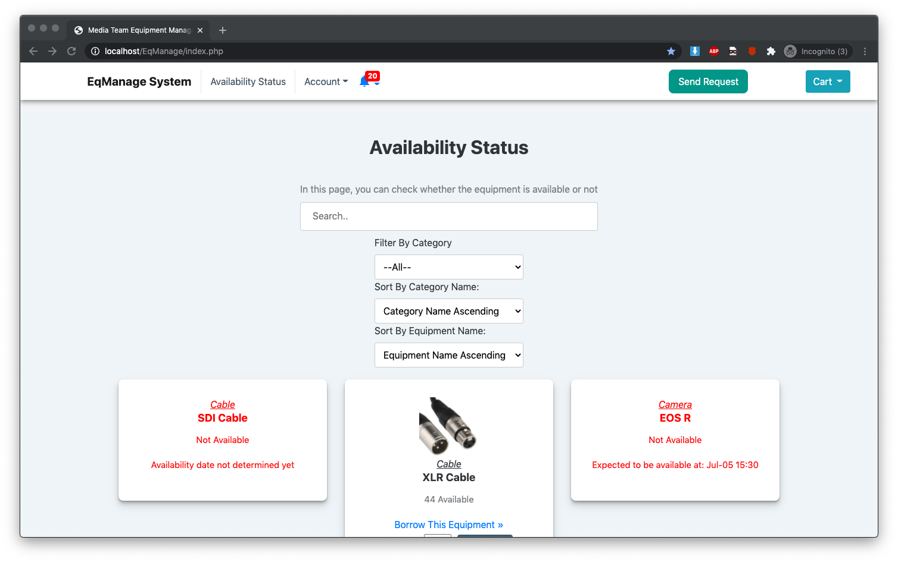
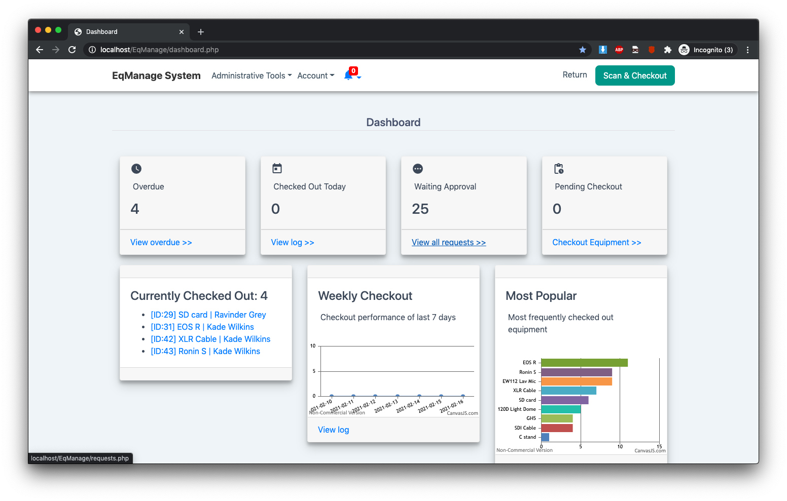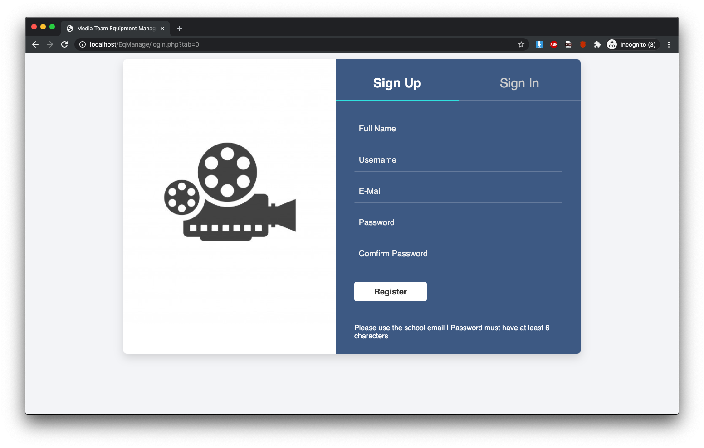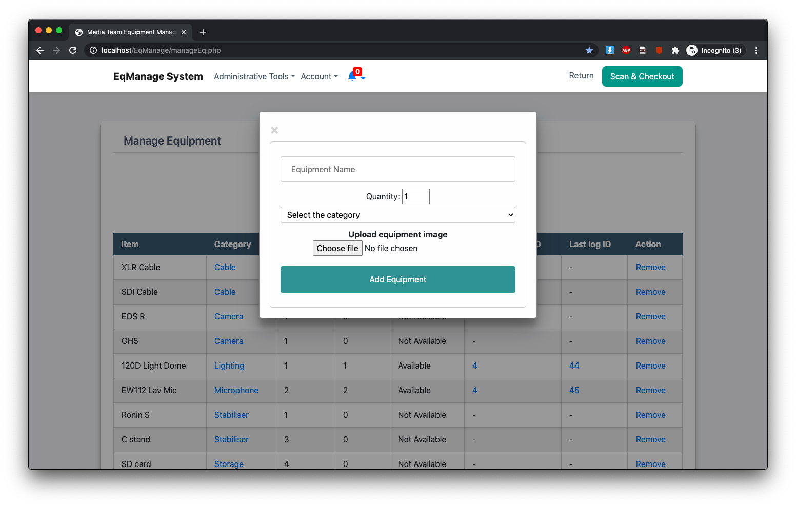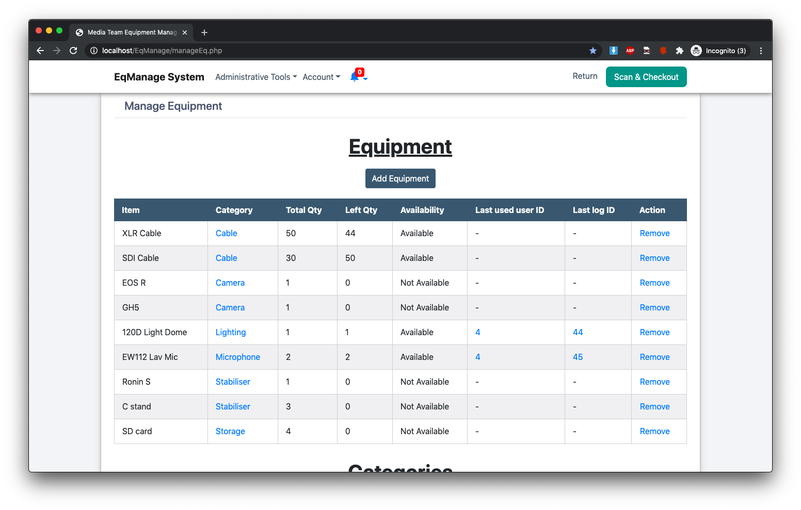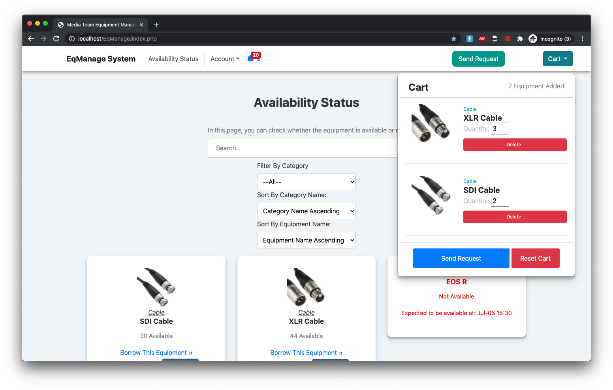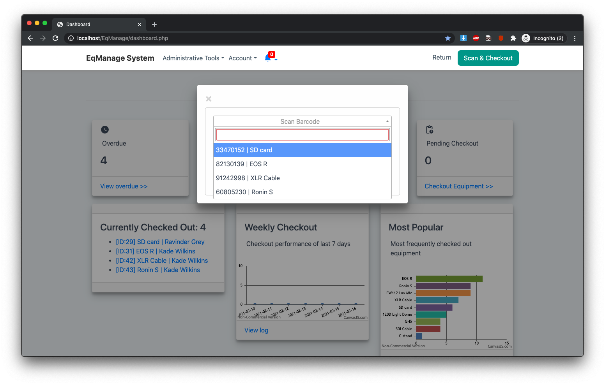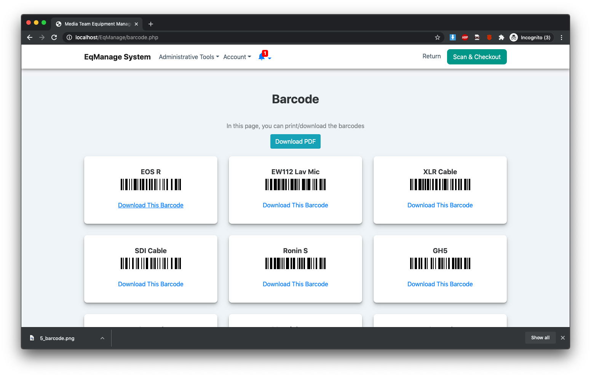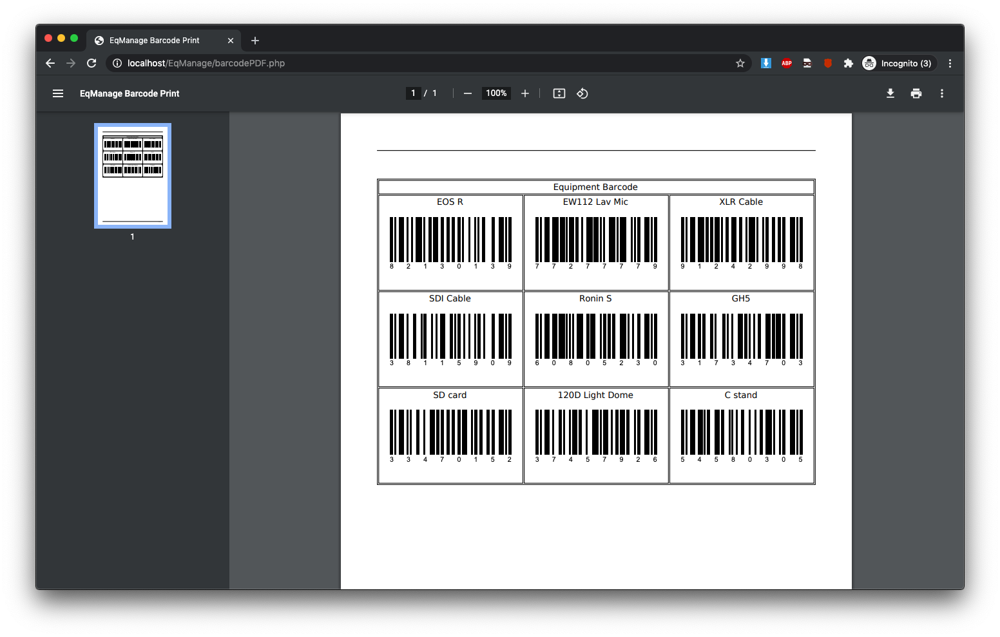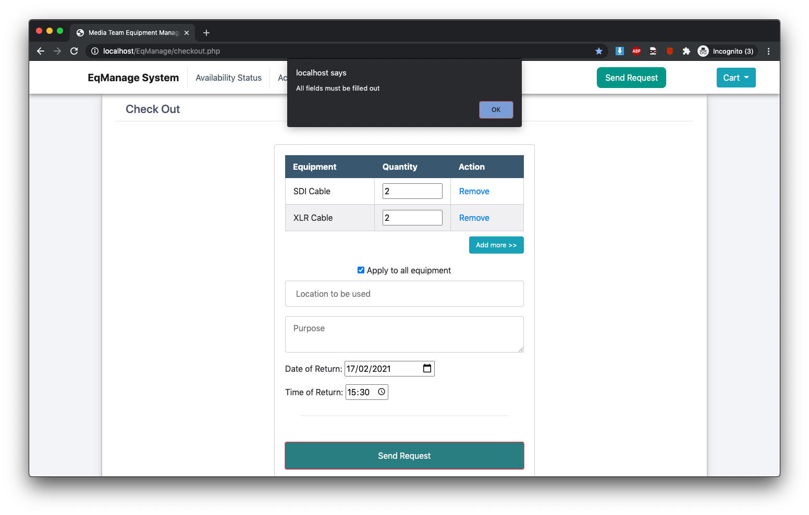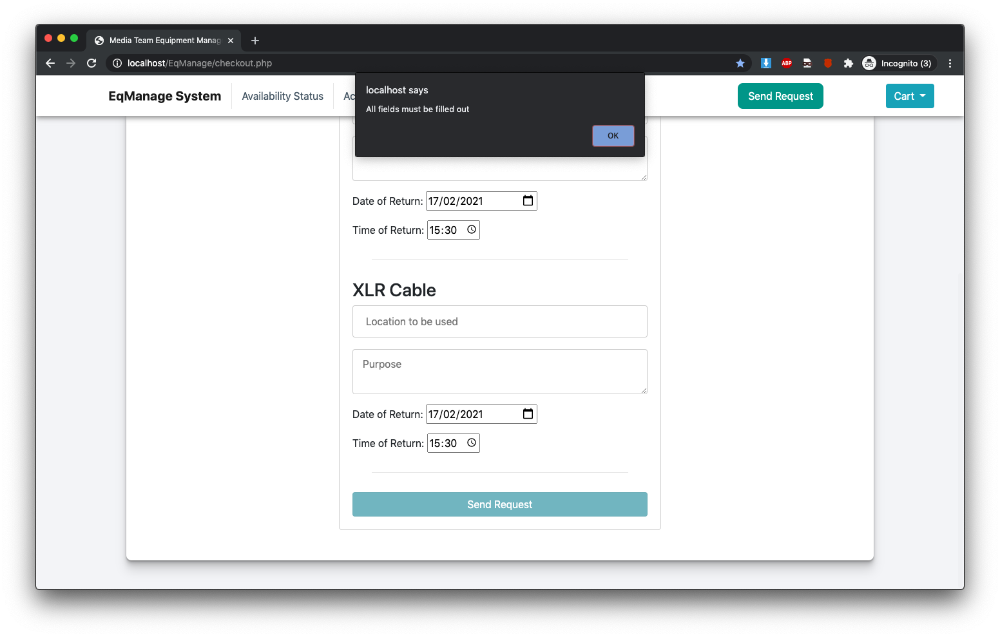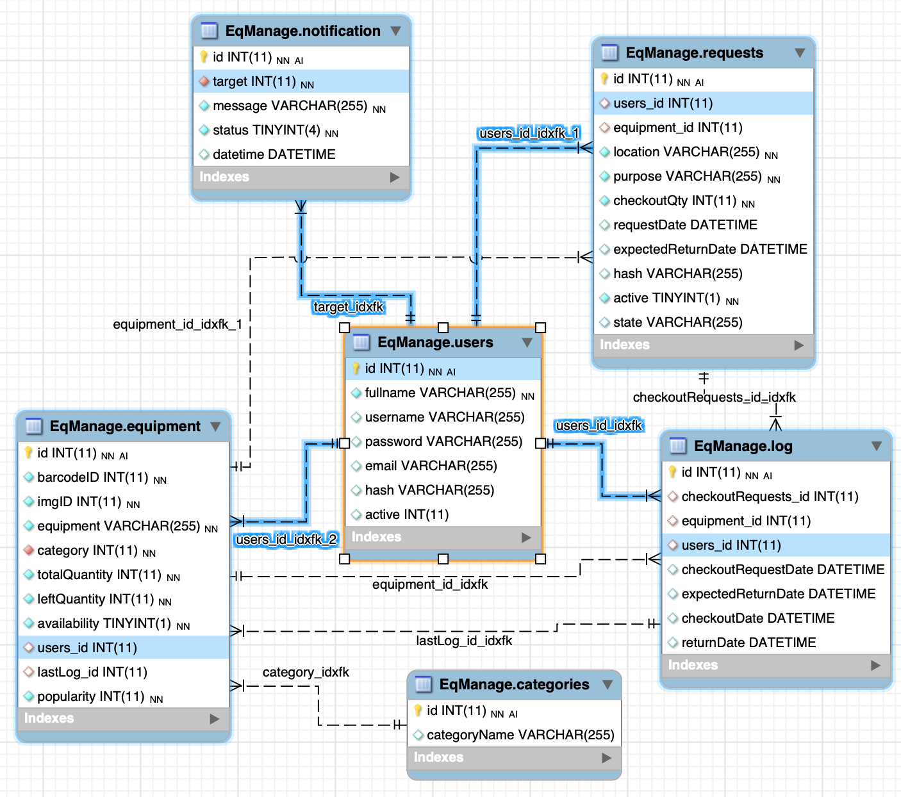
